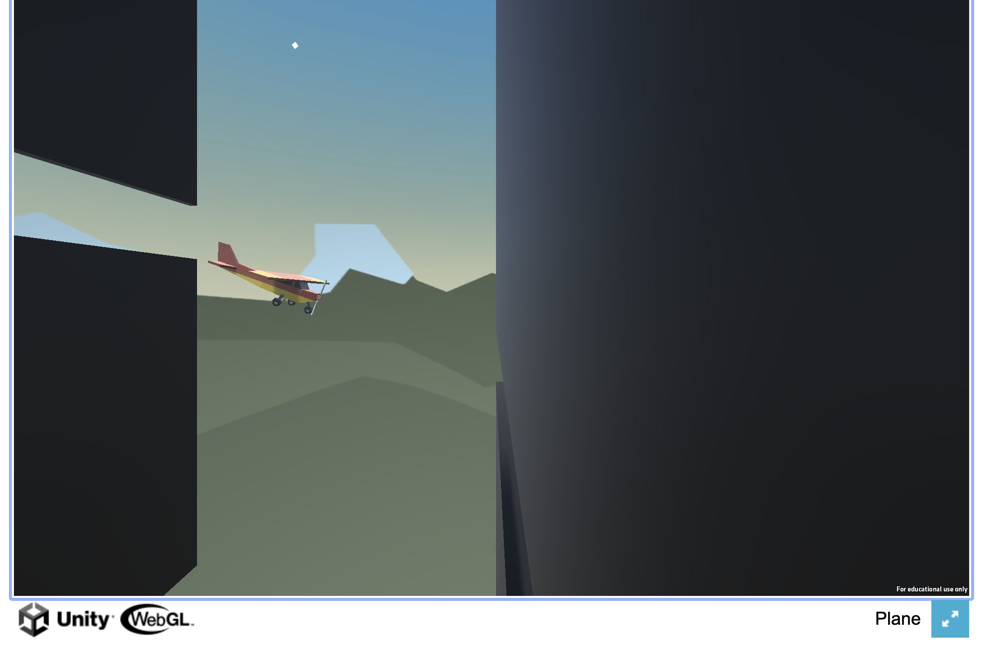

# Plane Obstacle Game

Welcome to the Plane Obstacle Game! In this simple yet challenging game, you control a plane, and your mission is to navigate through a series of obstacles without crashing into the walls. Your goal is to pass through the gaps between the walls and enjoy the thrill of flying.

### How to Play

1. **Start the Game**: To play the game, simply click on the following link: [Play Plane Obstacle Game](https://aagam1090.github.io/PlaneObstacleGame/PlaneBuild/).

2. **Controls**: Use your mouse or keyboard arrow keys to control the plane. The plane will move up when you click or press the up arrow key and down when you release or press the down arrow key.

3. **Avoid Obstacles**: Your plane will automatically move forward, and you must navigate it through the gaps between the walls. Be careful not to touch the walls; otherwise, it's game over!

### Game Features

- **Simple and Addictive**: The game's simple controls make it easy to pick up and play, providing an enjoyable gaming experience.

- **Endless Gameplay**: The game continues as long as you can avoid crashing into the walls, so you can play as much as you want.

- **Responsive Controls**: Use either your mouse or keyboard to control the plane, whichever is more comfortable for you.

### How to Contribute

If you're interested in contributing to this game or have ideas for improvements, you can find the [source code on GitHub](https://github.com/aagam1090/PlaneObstacleGame). Feel free to fork the repository, make enhancements, and submit pull requests.

### Credits

This game was created by Aagam Shah and is hosted on GitHub Pages. 
Enjoy playing the Plane Obstacle Game, and have fun dodging those walls!
